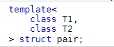

# APC-Library

Hi all, this is our 2nd Advanced topic for Advanced Programming Concepts. For this topic we are going to dive head-first into two types of standard library types, the `pair` and the `set` type.

We have all used various types of containers provided by the C++ standard library before. These containers are the foundation of data storage and manipulation in our C++ programs.
The C++ standard library takes away the need to set these containers up yourself.

Where this is good on one hand, the fact that these container types are given to us ready to be used can cause you to make mistakes in implementing the containers, as you might not fully understand the basics behind them.

To fix this potential lack of knowledge, we will dive into `std::vector` and `std::pair` of the C++ standard library.
We will first look into how these containers are implemented in the standard library, after which we will implement our own (basic) version of the containers.

##`std::pair`


[cppreference](https://en.cppreference.com/w/cpp/utility/pair) describes `std::pair` as follows:



`std::pair` is a special type of `std::tuple`. Where std::tuple doesn't have a fixed number of member variables, `std::pair` only ever has two.

As a C++ class this would look like:

```c
template <typename T1, typename T2>
class pair{
    T1 m_first;
    T2 m_second;
};
```
Where `m_first` and `m_second` are the pair's private member variables of types `T1` and `T2`.

This template shows a simple struct that holds two class variables `T1` and `T2`. `std::pair` has several basic member functions, such as a few constructors among which:
```c
template <typename T1, typename T2>

constexpr pair<T1, T2>();
pair( const T1& x, const T2& y );
pair( const pair& p ) = default;
```
These are the two default constructors and a copy constructor. The first constructor initializes an empty pair of types T1 and T2, whereas the second constructor takes two types and sets the values of m_first and m_second to these passed variables.
The third constructor takes an existing pair and copies its m_first and m_second values into its own.

std::pair doesn't need a generic get function, as it only ever has two member variables. Instead, it has the functions `first()` and `second()`.
An implementation of these functions looks as follows:

```c
template <typename T1, typename T2>
    T1 first(){
        return m_first;
    }
    
    T2 second(){
        return m_second;
    }
```

These functions speak for themselves as they simply return one member variable of type T1 or T2.